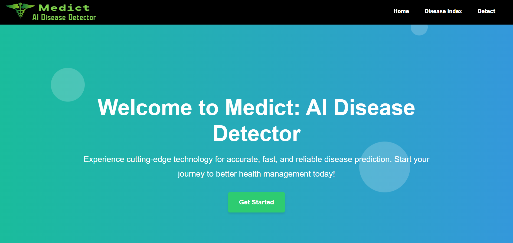
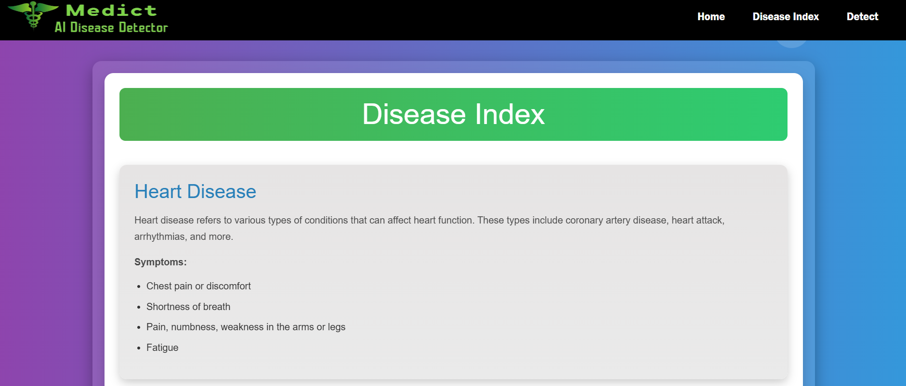
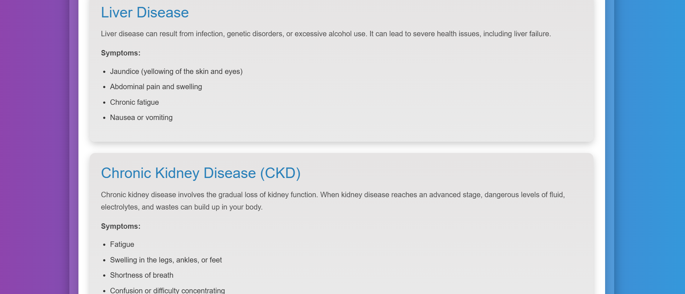
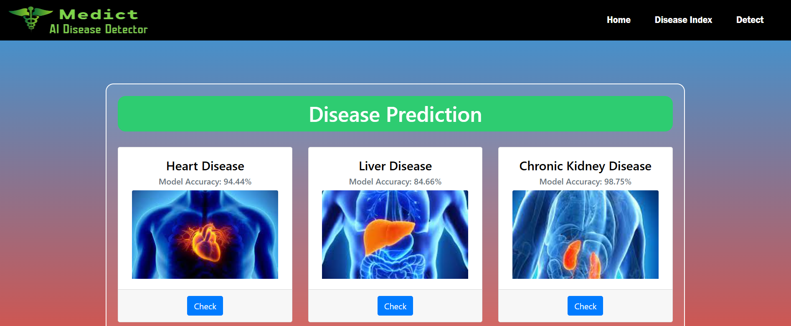

# Medict : AI Disease Detector

**Medict** is a robust multiple disease prediction system developed using ensemble machine learning algorithms. It is designed to predict several rare and common diseases, providing significant improvements in prediction accuracy. This system has the ability to predict the below following diseases:

- Lung Cancer
- Heart Disease
- Chronic Kidney Disease
- Brain Stroke
- Liver Disease
- Parkinson's Disease

The system leverages advanced machine learning techniques to achieve high accuracy in predictions, with an average improvement of 3-5% for each disease.

## Home Page

## Disease Index Page

## Prediction Page

## Features
- Predicts multiple diseases with high accuracy.
- Incorporates a user-friendly web interface for easy interaction.
- Real-time disease prediction with ensemble techniques.

## Tech Stack

- **Programming Language**: Python

- **Libraries and Frameworks**: 
  - scikit-learn
  - pandas
  - numpy
  - matplotlib
  - seaborn

- **Machine Learning Algorithms**:
  - Random Forest
  - Ada Boost
  - Gradient Boost
  - Bagging
  - Stacking

- **Tools**:
  - Jupyter Notebook
  - Google Colab

## Team Members

- **[Bratajit Das](https://github.com/Bratajit-03)** – Backend Developer and Team Leader  
- **[Avinav Chatterjee](https://github.com/AvinavCHATTERJEE2103028)** – Machine Learning Engineer  
- **[Aiyush Banerjee](https://github.com/Aiyush-Banerjee)** – Frontend Developer

  
## License

This project is licensed under the MIT License - see the [LICENSE](LICENSE) file for details.
